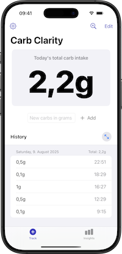
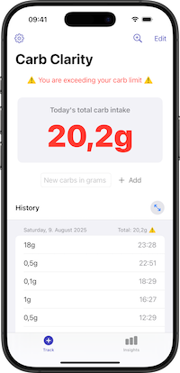
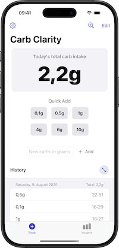
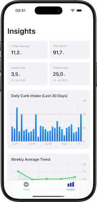
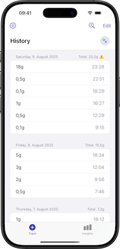
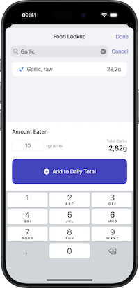
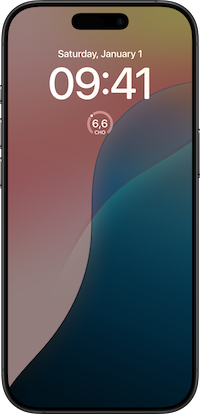

# Carb Clarity

A simple but modern iOS app for tracking daily carbohydrate intake with optional food lookup functionality.


## Screenshots









## App Store

Carb Clarity is available on the App Store. [Get it here](https://apps.apple.com/app/carb-clarity/id6504137655).

## Features

### Core Functionality
- **Daily Carb Tracking** – Simple interface to log carbohydrate intake throughout the day.
- **Dual Limit System** – Set both warning and caution daily carb limits with visual indicators.  
  - **Warning Limit** – First threshold with visual warning indicators.  
  - **Caution Limit** – Secondary threshold for stricter monitoring.  
  - **Toggleable Limits** – Enable or disable each limit independently.
- **Quick Add Buttons** – Preset buttons for common carb amounts (0.1g, 0.5g, 1g, 4g, 6g, 10g) with an optional toggle setting.
- **Food Lookup** – Optional integration with the USDA FoodData Central API for carbohydrate values.
- **iOS Widget** – Home screen widget showing today's carb total.
- **Apple Watch App & Widgets** – Native watchOS app and widgets for quick carb entry and daily summary.
- **Siri Shortcuts & App Intents** – Voice control and automation support.  
  - "Log carbs in Carb Clarity" – Add carb entries via Siri.  
  - "Check my carbs in Carb Clarity" – Get daily summary via voice.
- **History View** – Day-grouped entry display with totals and limit warnings.
- **Clean UI** – Modern SwiftUI interface with intuitive design.

### Insights & Analytics
- **Statistics**  
  - 7-day average carb intake.  
  - Monthly total calculations.  
  - Lowest and highest daily intake tracking.
- **Charts**  
  - Daily carb intake bar chart (last 30 days) with limit reference lines.  
  - Weekly average trend line chart with area fill.  
  - Built with Swift Charts framework.
- **Visual Indicators** – Reference lines showing warning and caution limits on charts.
- **Data Insights** – Automatic calculation of key metrics for better carb management.

## Architecture

Carb Clarity is built using modern iOS development practices with SwiftUI and SwiftData.

### Core Technologies
- **SwiftUI** – Modern declarative UI framework.
- **SwiftData** – Data persistence and Core Data replacement.
- **WidgetKit** – iOS home screen widgets with shared data between iOS, watchOS, and widgets.
- **WatchKit** – Native Apple Watch app development (UI built with SwiftUI).
- **Watch Connectivity** – Framework for reliable iPhone–Watch communication and widget updates.
- **App Intents** – Siri Shortcuts and voice control integration.
- **Swift 6** – Latest Swift language features with strict concurrency.

## Requirements
- iOS 18.0+
- watchOS 11.0+ (for Apple Watch app)
- Xcode 15.0+
- Swift 6.0+

## Installation

1. Clone the repository:
   ```bash
   git clone https://github.com/fouquet/CarbClarity.git
   ```

2. Open the project in Xcode:
   ```bash
   cd CarbClarity
   open CarbClarity.xcodeproj
   ```

3. Change the base identifiers in `Base.xcconfig`.

4. Build and run the project (`⌘+R`).

### Food Lookup (Optional)
To enable food lookup functionality:

1. Get a free API key from [USDA FoodData Central](https://fdc.nal.usda.gov/api-guide.html)
2. Open the app and go to Settings
3. Enter your API key and enable "Food Lookup"
4. Use the search icon in the main view to look up foods

### Siri Shortcuts & Voice Control
1. **Log Carbs via Siri**  
   - Say "Log carbs in Carb Clarity" or "Add carbs to Carb Clarity".  
   - Siri will ask for the carb amount.  
   - Provide the number and Siri will log it automatically.  
2. **Get Daily Summary via Siri**  
   - Say "Check my carbs in Carb Clarity" or "How many carbs today in Carb Clarity".  
   - Siri will report your current daily total and any limit warnings.  
3. **Shortcuts App Integration**  
   - Create custom automations using the Carb Clarity intents.  
   - Combine with other shortcuts for complex workflows.

## Testing

The project includes a wide range of tests:

#### Unit Tests
- ViewModels and business logic.  
- API integration and error handling.  
- Data models and extensions.  
- Mock-based testing with dependency injection.

#### UI Tests
- Complete user interface automation testing.  
- Swift 6 concurrency-compliant test suite.  
- UI tests run through the `CarbClarityUITestRunner` target with a dedicated test app entry point.  
- Uses in-memory storage and clean state between test runs for reliability.  
- Test data does not persist between runs.  
- Settings configuration and navigation.  
- Food lookup functionality.  
- Data entry and validation.  
- Accessibility testing.

Run tests in Xcode with `⌘+U` or via command line:

**Unit Tests:**
```bash
xcodebuild test -scheme CarbClarity -destination 'platform=iOS Simulator,name=iPhone 15 Pro'
```

**UI Tests:**
```bash
xcodebuild test -scheme CarbClarityUITestRunner -destination 'platform=iOS Simulator,name=iPhone 15 Pro'
```

## Development

### MockDataGenerator – Development & Testing Utility

Carb Clarity includes a `MockDataGenerator` class for creating realistic test data during development and testing. This utility helps developers test various scenarios without manually entering data. It also makes great data for screenshots ;-)

#### Features

**Basic Mock Data Generation**
- Generates carb entries spanning multiple days (default: 35 days).  
- Random entry counts per day (3–5 typical).  
- Realistic carb values (0.1g, 0.5g, 1g, 2g, 3g, 4g, 5g, 6g).  
- Random timestamps throughout the day (6 AM–10 PM).  
- Optional clearing of existing data before generation.

**Test Scenarios**
The generator supports three specialized patterns for comprehensive testing:

1. **Increasing Trend** (`TestScenario.increasingTrend`)  
   - Simulates gradually increasing carb intake over time.  
   - Base values increase from ~5g to ~15g over 35 days.  
   - Useful for testing upward trend visualizations in charts.  

2. **Decreasing Trend** (`TestScenario.decreasingTrend`)  
   - Simulates decreasing carb intake over time.  
   - Base values decrease from ~20g to ~10g over 35 days.  
   - Perfect for testing downward trend scenarios.  

3. **High Variability** (`TestScenario.highVariability`)  
   - Creates highly variable daily intake patterns.  
   - Realistic carb value range (0.1g–10.0g) with random selection.  
   - Variable entry counts per day (2–7).  
   - Tests edge cases and statistical calculations.  

#### Usage

The `MockDataGenerator` is included in the file system but not in the project by default. To use it:
- Add `MockDataGenerator.swift` to the *CarbClarity* target.  
- Uncomment the relevant lines in `TrackView.swift`.  
- Run the app in debug mode to see the "Debug" menu.

## Contributing

Contributions are welcome! Submit a Pull Request. For major changes, open an issue first to discuss the proposal.

## License

This project is licensed under the MIT License – see the [LICENSE](LICENSE) file for details.

## Support

If you encounter any issues or have questions:
- Check the [Issues](https://github.com/fouquet/CarbClarity/issues) page.
- Create a new issue with detailed information.
- Contact: support@fouquet.me

---

**Note**: This app is for informational purposes only and should not replace professional medical advice. Always consult healthcare professionals for dietary and health-related decisions.
